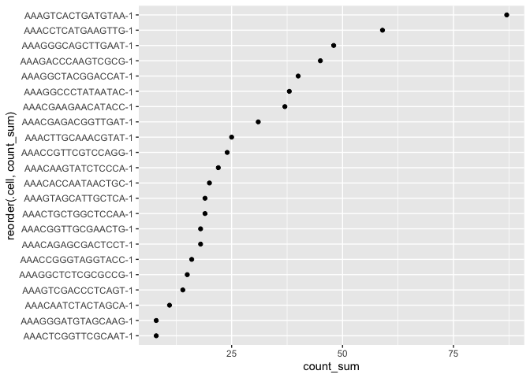
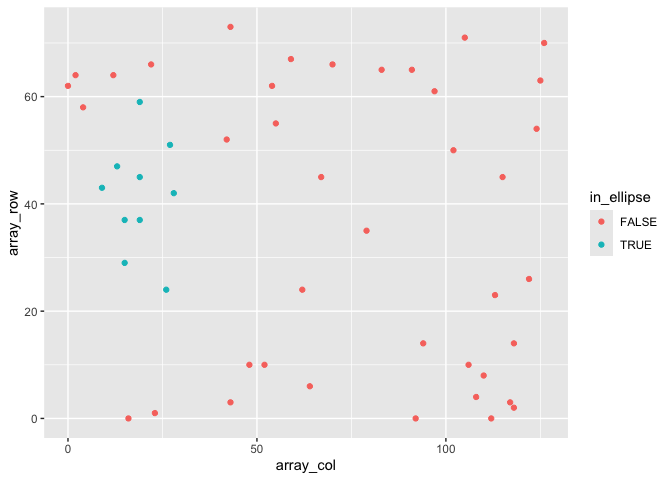

<!-- README.md is generated from README.Rmd. Please edit that file -->

# tidySpatialExperiment - part of *tidyomics* 

<!-- badges: start -->

[](https://www.tidyverse.org/lifecycle/#experimental)
[](https://github.com/william-hutchison/tidySpatialExperiment/actions)

<!-- badges: end -->

# Introduction

tidySpatialExperiment provides a bridge between the
[SpatialExperiment](https://github.com/drighelli/SpatialExperiment)
package and the [*tidyverse*](https://www.tidyverse.org) ecosystem. It
creates an invisible layer that allows you to interact with a
`SpatialExperiment` object as if it were a tibble; enabling the use of
functions from [dplyr](https://github.com/tidyverse/dplyr),
[tidyr](https://github.com/tidyverse/tidyr),
[ggplot2](https://github.com/tidyverse/ggplot2) and
[plotly](https://github.com/plotly/plotly.R). But, underneath, your data
remains a `SpatialExperiment` object.

tidySpatialExperiment also provides five additional utility functions.

## Resources

If you would like to learn more about tidySpatialExperiment and
*tidyomics*, the following links are a good place to start:

- [The tidySpatialExperiment
  website](http://william-hutchison.github.io/tidySpatialExperiment/)
- [The tidyomics website](https://github.com/tidyomics)

The *tidyomics* ecosystem also includes packages for:

- Working with genomic features:

  - [plyranges](https://github.com/sa-lee/plyranges), for tidy
    manipulation of genomic range data.
  - [nullranges](https://github.com/nullranges/nullranges), for tidy
    generation of genomic ranges representing the null hypothesis.
  - [plyinteractions](https://github.com/tidyomics/plyinteractions), for
    tidy manipulation of genomic interaction data.

- Working with transcriptomic features:

  - [tidySummarizedExperiment](https://github.com/stemangiola/tidySummarizedExperiment),
    for tidy manipulation of `SummarizedExperiment` objects.
  - [tidySingleCellExperiment](https://github.com/stemangiola/tidySingleCellExperiment),
    for tidy manipulation of `SingleCellExperiment` objects.
  - [tidyseurat](https://github.com/stemangiola/tidyseurat), for tidy
    manipulation of `Seurat` objects.
  - [tidybulk](https://github.com/stemangiola/tidybulk), for bulk
    RNA-seq analysis.

- Working with cytometry features:

  - [tidytof](https://github.com/keyes-timothy/tidytof), for tidy
    manipulation of high-dimensional cytometry data.

- And a few associated packages:

  - [tidygate](https://github.com/stemangiola/tidygate), for manual
    gating of points in space.
  - [tidyheatmap](https://github.com/stemangiola/tidyHeatmap/), for
    modular heatmap contruction.

## Functions and utilities

| Package             | Functions available                                                                                                                                                                                                |
|---------------------|--------------------------------------------------------------------------------------------------------------------------------------------------------------------------------------------------------------------|
| `SpatialExperiment` | All                                                                                                                                                                                                                |
| `dplyr`             | `arrange`,`bind_rows`, `bind_cols`, `distinct`, `filter`, `group_by`, `summarise`, `select`, `mutate`, `rename`, `left_join`, `right_join`, `inner_join`, `slice`, `sample_n`, `sample_frac`, `count`, `add_count` |
| `tidyr`             | `nest`, `unnest`, `unite`, `separate`, `extract`, `pivot_longer`                                                                                                                                                   |
| `ggplot2`           | `ggplot`                                                                                                                                                                                                           |
| `plotly`            | `plot_ly`                                                                                                                                                                                                          |

| Utility             | Description                                                                      |
|---------------------|----------------------------------------------------------------------------------|
| `as_tibble`         | Convert cell data to a `tbl_df`                                                  |
| `join_features`     | Append feature data to cell data                                                 |
| `aggregate_cells`   | Aggregate cell-feature abundance into a pseudobulk `SummarizedExperiment` object |
| `rectangle`         | Select cells in a rectangular region of space                                    |
| `ellipse`           | Select cells in an elliptical region of space                                    |
| `gate_spatial`      |                                                                                  |
| `gate_programmatic` |                                                                                  |

## Installation

You can install the stable version of tidySpatialExperiment from
Bioconductor.

``` r
if (!requireNamespace("BiocManager", quietly = TRUE))
    install.packages("BiocManager")

BiocManager::install("tidySpatialExperiment")
```

Or, you can install the development version of tidySpatialExperiment
from GitHub.

``` r
if (!requireNamespace("pak", quietly = TRUE))
    install.packages("pak")

pak::pak("william-hutchison/tidySpatialExperiment")
```

## Load data

Here, we attach tidySpatialExperiment and an example `SpatialExperiment`
object.

``` r
# Load example SpatialExperiment object
library(tidySpatialExperiment)
example(read10xVisium)
```

## SpatialExperiment-tibble abstraction

A `SpatialExperiment` object represents assay-feature values as rows and
cells as columns. Additional information about the cells is stored in
the `reducedDims`, `colData` and `spatialCoords` slots.

tidySpatialExperiment provides a SpatialExperiment-tibble abstraction,
representing cells as rows and cell data as columns, in accordance with
the tidy observation-variable convention. The cell data is made up of
information stored in the `colData` and `spatialCoords` slots.

The default view is now of the SpatialExperiment-tibble abstraction.

``` r
spe
#  # A SpatialExperiment-tibble abstraction: 50 × 7
#  # Features = 50 | Cells = 50 | Assays = counts
#    .cell              in_tissue array_row array_col sample_id pxl_col_in_fullres
#    <chr>              <lgl>         <int>     <int> <chr>                  <int>
#  1 AAACAACGAATAGTTC-1 FALSE             0        16 section1                2312
#  2 AAACAAGTATCTCCCA-1 TRUE             50       102 section1                8230
#  3 AAACAATCTACTAGCA-1 TRUE              3        43 section1                4170
#  4 AAACACCAATAACTGC-1 TRUE             59        19 section1                2519
#  5 AAACAGAGCGACTCCT-1 TRUE             14        94 section1                7679
#  # ℹ 45 more rows
#  # ℹ 1 more variable: pxl_row_in_fullres <int>
```

But, our data maintains its status as a `SpatialExperiment` object.
Therefore, we have access to all `SpatialExperiment` functions.

``` r
spe |>
    colData() |>
    head()
#  DataFrame with 6 rows and 4 columns
#                     in_tissue array_row array_col   sample_id
#                     <logical> <integer> <integer> <character>
#  AAACAACGAATAGTTC-1     FALSE         0        16    section1
#  AAACAAGTATCTCCCA-1      TRUE        50       102    section1
#  AAACAATCTACTAGCA-1      TRUE         3        43    section1
#  AAACACCAATAACTGC-1      TRUE        59        19    section1
#  AAACAGAGCGACTCCT-1      TRUE        14        94    section1
#  AAACAGCTTTCAGAAG-1     FALSE        43         9    section1
```

``` r

spe |> 
    spatialCoords() |>
    head()
#                     pxl_col_in_fullres pxl_row_in_fullres
#  AAACAACGAATAGTTC-1               2312               1252
#  AAACAAGTATCTCCCA-1               8230               7237
#  AAACAATCTACTAGCA-1               4170               1611
#  AAACACCAATAACTGC-1               2519               8315
#  AAACAGAGCGACTCCT-1               7679               2927
#  AAACAGCTTTCAGAAG-1               1831               6400
```

``` r

spe |>
    imgData()
#  DataFrame with 1 row and 4 columns
#      sample_id    image_id   data scaleFactor
#    <character> <character> <list>   <numeric>
#  1    section1      lowres   ####   0.0510334
```

# Integration with the *tidyverse* ecosystem

## Manipulate with dplyr

Most functions from dplyr are available for use with the
SpatialExperiment-tibble abstraction. For example, `filter()` can be
used to filter cells by a variable of interest.

``` r
spe |>
   filter(array_col < 5)
#  # A SpatialExperiment-tibble abstraction: 3 × 7
#  # Features = 50 | Cells = 3 | Assays = counts
#    .cell              in_tissue array_row array_col sample_id pxl_col_in_fullres
#    <chr>              <lgl>         <int>     <int> <chr>                  <int>
#  1 AAACATGGTGAGAGGA-1 FALSE            62         0 section1                1212
#  2 AAACGAAGATGGAGTA-1 FALSE            58         4 section1                1487
#  3 AAAGAATGACCTTAGA-1 FALSE            64         2 section1                1349
#  # ℹ 1 more variable: pxl_row_in_fullres <int>
```

And `mutate` can be used to add new variables, or modify the value of an
existing variable.

``` r
spe |>
    mutate(in_region = c(in_tissue & array_row < 10))
#  # A SpatialExperiment-tibble abstraction: 50 × 8
#  # Features = 50 | Cells = 50 | Assays = counts
#    .cell     in_tissue array_row array_col sample_id in_region pxl_col_in_fullres
#    <chr>     <lgl>         <int>     <int> <chr>     <lgl>                  <int>
#  1 AAACAACG… FALSE             0        16 section1  FALSE                   2312
#  2 AAACAAGT… TRUE             50       102 section1  FALSE                   8230
#  3 AAACAATC… TRUE              3        43 section1  TRUE                    4170
#  4 AAACACCA… TRUE             59        19 section1  FALSE                   2519
#  5 AAACAGAG… TRUE             14        94 section1  FALSE                   7679
#  # ℹ 45 more rows
#  # ℹ 1 more variable: pxl_row_in_fullres <int>
```

## Tidy with tidyr

Most functions from tidyr are also available. Here, `nest()` is used to
group the data by `sample_id`, and `unnest()` is used to ungroup the
data.

``` r
# Nest the SpatialExperiment object by sample_id
spe_nested <-
    spe |> 
    nest(data = -sample_id)

# View the nested SpatialExperiment object
spe_nested
#  # A tibble: 1 × 2
#    sample_id data           
#    <chr>     <list>         
#  1 section1  <SptlExpr[,50]>
```

``` r

# Unnest the nested SpatialExperiment objects
spe_nested |>
    unnest(data)
#  # A SpatialExperiment-tibble abstraction: 50 × 7
#  # Features = 50 | Cells = 50 | Assays = counts
#    .cell              in_tissue array_row array_col sample_id pxl_col_in_fullres
#    <chr>              <lgl>         <int>     <int> <chr>                  <int>
#  1 AAACAACGAATAGTTC-1 FALSE             0        16 section1                2312
#  2 AAACAAGTATCTCCCA-1 TRUE             50       102 section1                8230
#  3 AAACAATCTACTAGCA-1 TRUE              3        43 section1                4170
#  4 AAACACCAATAACTGC-1 TRUE             59        19 section1                2519
#  5 AAACAGAGCGACTCCT-1 TRUE             14        94 section1                7679
#  # ℹ 45 more rows
#  # ℹ 1 more variable: pxl_row_in_fullres <int>
```

## Plot with ggplot2

The `ggplot()` function can be used to create a plot directly from a
`SpatialExperiment` object. This example also demonstrates how tidy
operations can be combined to build up more complex analysis.

``` r
spe |>
    filter(sample_id == "section1" & in_tissue) |>
    
    # Add a column with the sum of feature counts per cell
    mutate(count_sum = purrr::map_int(.cell, ~
        spe[, .x] |> 
            counts() |> 
            sum()
      )) |>
    
    # Plot with tidySpatialExperiment and ggplot2
    ggplot(aes(x = reorder(.cell, count_sum), y = count_sum)) +
    geom_point() +
    coord_flip()
```

<!-- -->

## Plot with plotly

The `plot_ly()` function can also be used to create a plot from a
`SpatialExperiment` object.

``` r
spe |>
    filter(sample_id == "section1") |>
    plot_ly(
        x = ~ array_col, 
        y = ~ array_row, 
        color = ~ in_tissue, 
        type = "scatter"
    )
```


# Integration with the *tidyomics* ecosystem

## Interactively select cells with tidygate

Different packages from the *tidyomics* ecosystem are easy to use
together. Here, tidygate is used to interactively gate cells based on
their array location.

``` r
spe_regions <-
    spe |> 
    filter(sample_id == "section1") |>
    mutate(region = tidygate::gate_chr(array_col, array_row))
```


# Utilities

## Append feature data to cell data

The *tidyomics* ecosystem places an emphasis on interacting with cell
data. To interact with feature data, the `join_features()` function can
be used to append assay-feature values to cell data.

``` r
# Join feature data in wide format, preserving the SpatialExperiment object
spe |>
    join_features(features = c("ENSMUSG00000025915", "ENSMUSG00000042501"), shape = "wide") |> 
    head()
#  # A SpatialExperiment-tibble abstraction: 50 × 9
#  # Features = 6 | Cells = 50 | Assays = counts
#    .cell              in_tissue array_row array_col sample_id ENSMUSG00000025915
#    <chr>              <lgl>         <int>     <int> <chr>                  <dbl>
#  1 AAACAACGAATAGTTC-1 FALSE             0        16 section1                   0
#  2 AAACAAGTATCTCCCA-1 TRUE             50       102 section1                   0
#  3 AAACAATCTACTAGCA-1 TRUE              3        43 section1                   0
#  4 AAACACCAATAACTGC-1 TRUE             59        19 section1                   0
#  5 AAACAGAGCGACTCCT-1 TRUE             14        94 section1                   0
#  # ℹ 45 more rows
#  # ℹ 3 more variables: ENSMUSG00000042501 <dbl>, pxl_col_in_fullres <int>,
#  #   pxl_row_in_fullres <int>
```

``` r

# Join feature data in long format, discarding the SpatialExperiment object
spe |>
    join_features(features = c("ENSMUSG00000025915", "ENSMUSG00000042501"), shape = "long") |> 
    head()
#  tidySpatialExperiment says: A data frame is returned for independent data 
#                analysis.
#  # A tibble: 6 × 7
#    .cell       in_tissue array_row array_col sample_id .feature .abundance_counts
#    <chr>       <lgl>         <int>     <int> <chr>     <chr>                <dbl>
#  1 AAACAACGAA… FALSE             0        16 section1  ENSMUSG…                 0
#  2 AAACAACGAA… FALSE             0        16 section1  ENSMUSG…                 0
#  3 AAACAAGTAT… TRUE             50       102 section1  ENSMUSG…                 0
#  4 AAACAAGTAT… TRUE             50       102 section1  ENSMUSG…                 1
#  5 AAACAATCTA… TRUE              3        43 section1  ENSMUSG…                 0
#  # ℹ 1 more row
```

## Aggregate cells

Sometimes, it is necessary to aggregate the gene-transcript abundance
from a group of cells into a single value. For example, when comparing
groups of cells across different samples with fixed-effect models.

The `aggregate_cells()` function can be used to aggregate cells by a
specified variable and assay, returning a `SummarizedExperiment` object.

``` r
spe |>
    aggregate_cells(in_tissue, assays = "counts")
#  class: SummarizedExperiment 
#  dim: 50 2 
#  metadata(0):
#  assays(1): counts
#  rownames(50): ENSMUSG00000002459 ENSMUSG00000005886 ...
#    ENSMUSG00000104217 ENSMUSG00000104328
#  rowData names(1): feature
#  colnames(2): FALSE TRUE
#  colData names(3): in_tissue .aggregated_cells sample_id
```

## Elliptical and rectangular region selection

The `ellipse()` and `rectangle()` functions can be used to select cells
by their position in space.

``` r
spe |>
    filter(sample_id == "section1") |>
    mutate(in_ellipse = ellipse(array_col, array_row, c(20, 40), c(20, 20))) |>
    ggplot(aes(x = array_col, y = array_row, colour = in_ellipse)) +
    geom_point()
```

<!-- -->

## Interactive gating

For interactive selection of cells in space, tidySpatialExperiment
experiment provides `gate_interactive()`. This function uses
[tidygate](https://github.com/stemangiola/tidygate), shiny and plotly to
launch an interactive plot overlaying cells in position with image data.
Additional parameters can be used to specify point colour and shape by
column value, and define the size and alpha of all points. Note that
this feature is currently only available in the development version of
tidySpatialExperiment.

``` r
spe_gated <- 
  spe |>
  gate_interactive(colour_column = "in_tissue", alpha = 0.8)
```


    #  tidygate says: this feature is in early development and may undergo changes or contain bugs.

A record of which points appear in which gates is appended to the
SpatialExperiment object in the `.gate_interactive` column. To select
cells which appear within any gates, the `lengths()` function can be
used. To select cells which appear within a specific gate, `map_lgl()`
can be used with `any()` to cehck each value in `.gate_interactive` for
each cell.

``` r
# Select cells within any gate
spe_gated |> 
  filter(lengths(.gate_interactive) > 0)
#  # A SpatialExperiment-tibble abstraction: 0 × 8
#  # Features = 50 | Cells = 0 | Assays = counts
#  # ℹ 8 variables: .cell <chr>, in_tissue <lgl>, array_row <int>,
#  #   array_col <int>, sample_id <chr>, .gate_interactive <list>,
#  #   pxl_col_in_fullres <int>, pxl_row_in_fullres <int>
```

``` r

# Select cells within gate 2
spe_gated |>
  filter(purrr::map_lgl(.gate_interactive, ~ any(2 %in% .x)))
#  # A SpatialExperiment-tibble abstraction: 0 × 8
#  # Features = 50 | Cells = 0 | Assays = counts
#  # ℹ 8 variables: .cell <chr>, in_tissue <lgl>, array_row <int>,
#  #   array_col <int>, sample_id <chr>, .gate_interactive <list>,
#  #   pxl_col_in_fullres <int>, pxl_row_in_fullres <int>
```

Details of the gated points and lasso brush selection are stored within
the `tidygate_env` environment. These variables are overwritten each
time interactive gating is run, so save them right away if you would
like to access them later.

``` r
# Information about the gated points 
tidygate_env$select_data
#    X    x    y key .gate
#  1 1 5477 4125  43     1
#  2 2 3000 4125  44     1
#  3 3 6647 5442  21     2
#  4 4 5821 6639  31     2
#  5 5 5477 4125  43     2
```

``` r

# Information about the lasso brush path
tidygate_env$brush_data
#      X        x        y .gate
#  1   1 5576.396 3432.722     1
#  2   2 4902.921 3042.815     1
#  3   3 4123.107 2936.477     1
#  4   4 3024.279 3290.937     1
#  5   5 2811.603 3609.952     1
#  6   6 2882.495 4141.643     1
#  7   7 3307.848 4566.996     1
#  8   8 4335.783 4566.996     1
#  9   9 4548.460 4708.780     1
#  10 10 5540.950 5134.133     1
#  11 11 6143.533 5134.133     1
#  12 12 6320.763 4886.010     1
#  13 13 6320.763 4602.442     1
#  14 14 6143.533 4177.089     1
#  15 15 5930.856 3716.290     2
#  16 16 5470.058 3503.614     2
#  17 17 5080.151 3680.844     2
#  18 18 5080.151 4035.305     2
#  19 19 5611.842 4779.672     2
#  20 20 6249.871 5346.809     2
#  21 21 6178.979 5630.378     2
#  22 22 5682.734 6091.176     2
#  23 23 5505.504 6374.745     2
#  24 24 5611.842 6870.990     2
#  25 25 5895.410 7119.112     2
#  26 26 6320.763 7083.666     2
#  27 27 6746.116 6587.421     2
#  28 28 7029.684 5772.162     2
#  29 29 7029.684 5417.701     2
#  30 30 6817.008 4744.226     2
#  31 31 6817.008 4708.780     2
```

`gate_programmatic` gates points programmatically by their spatial
coordinates, and a predefined lasso brush path. This function can be
used to make interactive gates reproducible. Here `gate_programmatic`
reproduces the previous defined interactive gates exactly and appends
results to the `.gate_programmatic` column.

``` r
spe_gated |>
  gate_programmatic(tidygate_env$brush_data)
#  tidygate says: this feature is in early development and may undergo changes or contain bugs.
#  # A SpatialExperiment-tibble abstraction: 50 × 9
#  # Features = 50 | Cells = 50 | Assays = counts
#    .cell              in_tissue array_row array_col sample_id .gate_interactive
#    <chr>              <lgl>         <int>     <int> <chr>     <list>           
#  1 AAACAACGAATAGTTC-1 FALSE             0        16 section1  <NULL>           
#  2 AAACAAGTATCTCCCA-1 TRUE             50       102 section1  <NULL>           
#  3 AAACAATCTACTAGCA-1 TRUE              3        43 section1  <NULL>           
#  4 AAACACCAATAACTGC-1 TRUE             59        19 section1  <NULL>           
#  5 AAACAGAGCGACTCCT-1 TRUE             14        94 section1  <NULL>           
#  # ℹ 45 more rows
#  # ℹ 3 more variables: .gate_programmatic <list>, pxl_col_in_fullres <int>,
#  #   pxl_row_in_fullres <int>
```

# Special column behaviour

Removing the `.cell` column will return a tibble. This is consistent
with the behaviour in other *tidyomics* packages.

``` r
spe |>
    select(-.cell) |>
    head()
#  tidySpatialExperiment says: Key columns are missing. A data frame is 
#                          returned for independent data analysis.
#  # A tibble: 6 × 4
#    in_tissue array_row array_col sample_id
#    <lgl>         <int>     <int> <chr>    
#  1 FALSE             0        16 section1 
#  2 TRUE             50       102 section1 
#  3 TRUE              3        43 section1 
#  4 TRUE             59        19 section1 
#  5 TRUE             14        94 section1 
#  # ℹ 1 more row
```

The `sample_id` column cannot be removed with *tidyverse* functions, and
can only be modified if the changes are accepted by SpatialExperiment’s
`colData()` function.

``` r
# sample_id is not removed, despite the user's request
spe |>
    select(-sample_id)
#  # A SpatialExperiment-tibble abstraction: 50 × 7
#  # Features = 50 | Cells = 50 | Assays = counts
#    .cell              in_tissue array_row array_col sample_id pxl_col_in_fullres
#    <chr>              <lgl>         <int>     <int> <chr>                  <int>
#  1 AAACAACGAATAGTTC-1 FALSE             0        16 section1                2312
#  2 AAACAAGTATCTCCCA-1 TRUE             50       102 section1                8230
#  3 AAACAATCTACTAGCA-1 TRUE              3        43 section1                4170
#  4 AAACACCAATAACTGC-1 TRUE             59        19 section1                2519
#  5 AAACAGAGCGACTCCT-1 TRUE             14        94 section1                7679
#  # ℹ 45 more rows
#  # ℹ 1 more variable: pxl_row_in_fullres <int>
```

``` r

# This change maintains separation of sample_ids and is permitted
spe |> 
    mutate(sample_id = stringr::str_c(sample_id, "_modified")) |>
    head()
#  # A SpatialExperiment-tibble abstraction: 50 × 7
#  # Features = 6 | Cells = 50 | Assays = counts
#    .cell              in_tissue array_row array_col sample_id  pxl_col_in_fullres
#    <chr>              <lgl>         <int>     <int> <chr>                   <int>
#  1 AAACAACGAATAGTTC-1 FALSE             0        16 section1_…               2312
#  2 AAACAAGTATCTCCCA-1 TRUE             50       102 section1_…               8230
#  3 AAACAATCTACTAGCA-1 TRUE              3        43 section1_…               4170
#  4 AAACACCAATAACTGC-1 TRUE             59        19 section1_…               2519
#  5 AAACAGAGCGACTCCT-1 TRUE             14        94 section1_…               7679
#  # ℹ 45 more rows
#  # ℹ 1 more variable: pxl_row_in_fullres <int>
```

``` r

# This change does not maintain separation of sample_ids and produces an error
spe |>
    mutate(sample_id = "new_sample")
#  # A SpatialExperiment-tibble abstraction: 50 × 7
#  # Features = 50 | Cells = 50 | Assays = counts
#    .cell              in_tissue array_row array_col sample_id  pxl_col_in_fullres
#    <chr>              <lgl>         <int>     <int> <chr>                   <int>
#  1 AAACAACGAATAGTTC-1 FALSE             0        16 new_sample               2312
#  2 AAACAAGTATCTCCCA-1 TRUE             50       102 new_sample               8230
#  3 AAACAATCTACTAGCA-1 TRUE              3        43 new_sample               4170
#  4 AAACACCAATAACTGC-1 TRUE             59        19 new_sample               2519
#  5 AAACAGAGCGACTCCT-1 TRUE             14        94 new_sample               7679
#  # ℹ 45 more rows
#  # ℹ 1 more variable: pxl_row_in_fullres <int>
```

The `pxl_col_in_fullres` and `px_row_in_fullres` columns cannot be
removed or modified with *tidyverse* functions. This is consistent with
the behaviour of dimension reduction data in other *tidyomics* packages.

``` r
# Attempting to remove pxl_col_in_fullres produces an error
spe |>
    select(-pxl_col_in_fullres)
#  Error in `select_helper()`:
#  ! Can't select columns that don't exist.
#  ✖ Column `pxl_col_in_fullres` doesn't exist.
```

``` r

# Attempting to modify pxl_col_in_fullres produces an error
spe |> 
    mutate(pxl_col_in_fullres)
#  Error in `dplyr::mutate()`:
#  ℹ In argument: `pxl_col_in_fullres`.
#  Caused by error:
#  ! object 'pxl_col_in_fullres' not found
```
