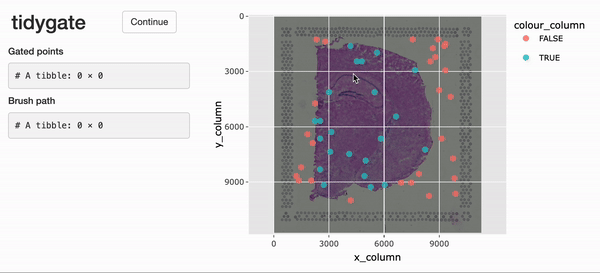

# Introduction

tidySpatialExperiment provides a bridge between the
[SpatialExperiment](https://github.com/drighelli/SpatialExperiment)
package and the [*tidyverse*](https://www.tidyverse.org) ecosystem. It
creates an invisible layer that allows you to interact with a
`SpatialExperiment` object as if it were a tibble; enabling the use of
functions from [dplyr](https://github.com/tidyverse/dplyr),
[tidyr](https://github.com/tidyverse/tidyr),
[ggplot2](https://github.com/tidyverse/ggplot2) and
[plotly](https://github.com/plotly/plotly.R). But, underneath, your data
remains a `SpatialExperiment` object.

tidySpatialExperiment also provides five additional utility functions.

## Resources 

If you would like to learn more about tidySpatialExperiment and *tidyomics*, the following links are a good place to start:

-   [The tidySpatialExperiment
    website](http://william-hutchison.github.io/tidySpatialExperiment/)
-   [The tidyomics website](https://github.com/tidyomics)

The *tidyomics* ecosystem also includes packages for:

-   Working with genomic features:

    -   [plyranges](https://github.com/sa-lee/plyranges), for tidy
        manipulation of genomic range data.
    -   [nullranges](https://github.com/nullranges/nullranges), for tidy
        generation of genomic ranges representing the null hypothesis.
    -   [plyinteractions](https://github.com/tidyomics/plyinteractions),
        for tidy manipulation of genomic interaction data.

-   Working with transcriptomic features:

    -   [tidySummarizedExperiment](https://github.com/stemangiola/tidySummarizedExperiment),
        for tidy manipulation of `SummarizedExperiment` objects.
    -   [tidySingleCellExperiment](https://github.com/stemangiola/tidySingleCellExperiment),
        for tidy manipulation of `SingleCellExperiment` objects.
    -   [tidyseurat](https://github.com/stemangiola/tidyseurat), for
        tidy manipulation of `Seurat` objects.
    -   [tidybulk](https://github.com/stemangiola/tidybulk), for bulk
        RNA-seq analysis.

-   Working with cytometry features:

    -   [tidytof](https://github.com/keyes-timothy/tidytof), for tidy
        manipulation of high-dimensional cytometry data.

-   And a few associated packages:

    -   [tidygate](https://github.com/stemangiola/tidygate), for manual
        gating of points in space.
    -   [tidyheatmap](https://github.com/stemangiola/tidyHeatmap/), for
        modular heatmap contruction.

## Functions and utilities

| Package             | Functions available                                                                                                                                                                                                |
|-----------------------------------|-------------------------------------|
| `SpatialExperiment` | All                                                                                                                                                                                                                |
| `dplyr`             | `arrange`,`bind_rows`, `bind_cols`, `distinct`, `filter`, `group_by`, `summarise`, `select`, `mutate`, `rename`, `left_join`, `right_join`, `inner_join`, `slice`, `sample_n`, `sample_frac`, `count`, `add_count` |
| `tidyr`             | `nest`, `unnest`, `unite`, `separate`, `extract`, `pivot_longer`                                                                                                                                                   |
| `ggplot2`           | `ggplot`                                                                                                                                                                                                           |
| `plotly`            | `plot_ly`                                                                                                                                                                                                          |

| Utility           | Description                                                                      |
|-----------------------------------|-------------------------------------|
| `as_tibble`         | Convert cell data to a `tbl_df`                                                  |
| `join_features`     | Append feature data to cell data                                                 |
| `aggregate_cells`   | Aggregate cell-feature abundance into a pseudobulk `SummarizedExperiment` object |
| `rectangle`         | Select cells in a rectangular region of space                                               |
| `ellipse`           | Select cells in an elliptical region of space                                                |
| `gate_spatial`      |  |
| `gate_programmatic` |  |


## Installation

You can install the stable version of tidySpatialExperiment from
Bioconductor.

```{r, eval=FALSE}
if (!requireNamespace("BiocManager", quietly = TRUE))
    install.packages("BiocManager")

BiocManager::install("tidySpatialExperiment")
```

Or, you can install the development version of tidySpatialExperiment
from GitHub.

```{r, eval=FALSE}
if (!requireNamespace("pak", quietly = TRUE))
    install.packages("pak")

pak::pak("william-hutchison/tidySpatialExperiment")
```

## Load data

Here, we attach tidySpatialExperiment and an example `SpatialExperiment`
object.

```{r, message=FALSE, results=FALSE}
# Load example SpatialExperiment object
library(tidySpatialExperiment)
example(read10xVisium)
```

```{r, echo=FALSE}
# Remove unneeded second sample from demo data
spe <-
    spe |>
    filter(sample_id == "section1")
```

## SpatialExperiment-tibble abstraction

A `SpatialExperiment` object represents assay-feature values as rows and
cells as columns. Additional information about the cells is stored in the
`reducedDims`, `colData` and `spatialCoords` slots.

tidySpatialExperiment provides a SpatialExperiment-tibble abstraction,
representing cells as rows and cell data as columns, in accordance with the
tidy observation-variable convention. The cell data is made up of information stored in the `colData` and `spatialCoords` slots.

The default view is now of the SpatialExperiment-tibble abstraction.

```{r}
spe
```

But, our data maintains its status as a `SpatialExperiment` object.
Therefore, we have access to all `SpatialExperiment` functions.

```{r}
spe |>
    colData() |>
    head()

spe |> 
    spatialCoords() |>
    head()

spe |>
    imgData()
```

# Integration with the *tidyverse* ecosystem

## Manipulate with dplyr

Most functions from dplyr are available for use with the
SpatialExperiment-tibble abstraction. For example, `filter()` can be used
to filter cells by a variable of interest.

```{r}
spe |>
   filter(array_col < 5)

```

And `mutate` can be used to add new variables, or modify the value of an
existing variable.

```{r}
spe |>
    mutate(in_region = c(in_tissue & array_row < 10))
```

## Tidy with tidyr

Most functions from tidyr are also available. Here, `nest()` is used to
group the data by `sample_id`, and `unnest()` is used to ungroup the data.

```{r}
# Nest the SpatialExperiment object by sample_id
spe_nested <-
    spe |> 
    nest(data = -sample_id)

# View the nested SpatialExperiment object
spe_nested

# Unnest the nested SpatialExperiment objects
spe_nested |>
    unnest(data)
```

## Plot with ggplot2

The `ggplot()` function can be used to create a plot directly from a
`SpatialExperiment` object. This example also demonstrates how tidy
operations can be combined to build up more complex analysis.

```{r}
spe |>
    filter(sample_id == "section1" & in_tissue) |>
    
    # Add a column with the sum of feature counts per cell
    mutate(count_sum = purrr::map_int(.cell, ~
        spe[, .x] |> 
            counts() |> 
            sum()
      )) |>
    
    # Plot with tidySpatialExperiment and ggplot2
    ggplot(aes(x = reorder(.cell, count_sum), y = count_sum)) +
    geom_point() +
    coord_flip()
```

## Plot with plotly

The `plot_ly()` function can also be used to create a plot from a
`SpatialExperiment` object.

```{r, eval=FALSE, message=FALSE, warning=FALSE}
spe |>
    filter(sample_id == "section1") |>
    plot_ly(
        x = ~ array_col, 
        y = ~ array_row, 
        color = ~ in_tissue, 
        type = "scatter"
    )
```


# Utilities

## Append feature data to cell data

The *tidyomics* ecosystem places an emphasis on interacting with cell
data. To interact with feature data, the `join_features()` function can be
used to append assay-feature values to cell data.

```{r}
# Join feature data in wide format, preserving the SpatialExperiment object
spe |>
    join_features(features = c("ENSMUSG00000025915", "ENSMUSG00000042501"), shape = "wide") |> 
    head()

# Join feature data in long format, discarding the SpatialExperiment object
spe |>
    join_features(features = c("ENSMUSG00000025915", "ENSMUSG00000042501"), shape = "long") |> 
    head()
```

## Aggregate cells

Sometimes, it is necessary to aggregate the gene-transcript abundance
from a group of cells into a single value. For example, when comparing
groups of cells across different samples with fixed-effect models.

The `aggregate_cells()` function can be used to aggregate cells by a
specified variable and assay, returning a `SummarizedExperiment` object.

```{r}
spe |>
    aggregate_cells(in_tissue, assays = "counts")
```

## Elliptical and rectangular region selection

The `ellipse()` and `rectangle()` functions can be used to select cells by
their position in space.

```{r}
spe |>
    filter(sample_id == "section1") |>
    mutate(in_ellipse = ellipse(array_col, array_row, c(20, 40), c(20, 20))) |>
    ggplot(aes(x = array_col, y = array_row, colour = in_ellipse)) +
    geom_point()
```

## Interactive gating

For the interactive selection of cells in space, tidySpatialExperiment experiment provides `gate()`. This function uses [tidygate](https://github.com/stemangiola/tidygate), shiny and plotly to launch an interactive plot overlaying cells in position with image data. Additional parameters can be used to specify point colour, shape, size and alpha, either with a column in the SpatialExperiment object or a constant value.

```{r, eval=FALSE}
spe_gated <- 
  spe |>
  gate(colour = "in_tissue", alpha = 0.8)
```


```{r, echo=FALSE}
# Load pre-recorded brush path from data for example
data("demo_brush_data", package = "tidySpatialExperiment")

tidygate_env <<- rlang::env()
tidygate_env$gates <- demo_brush_data 

spe_gated <-
  spe |>
  gate(programmatic_gates = tidygate_env$gates)
```

A record of which points appear in which gates is appended to the SpatialExperiment object in the `.gated` column. To select cells which appear within any gates, filter for non-NA values. To select cells which appear within a specific gate, string pattern matching can be used.

```{r}
# Select cells within any gate
spe_gated |> 
  filter(!is.na(.gated))
# Select cells within gate 2
spe_gated |>
  filter(stringr::str_detect(.gated, "2"))
```

Details of the interactively drawn gates are saved to `tidygate_env$gates`. This variable is overwritten each time interactive gates are drawn, so save it right away if you would like to access it later.  

```{r}
# Inspect previously drawn gates
tidygate_env$gates |>
  head()
```

```{r, eval=FALSE}
# Save if needed
tidygate_env$gates |>
  write_rds("important_gates.rds")
```

If previously drawn gates are supplied to the `programmatic_gates` argument, cells will be gated programmatically. This feature allows the reproduction of previously drawn interactive gates.

```{r, eval=FALSE}
important_gates <-
  read_rds("important_gates.rds")

spe |>
  gate(programmatic_gates = important_gates)) |>
  filter(!is.na(.gated))
```

```{r, echo=FALSE}
spe |>
  gate(programmatic_gates = tidygate_env$gates) |>
  filter(!is.na(.gated))
```

# Special column behaviour

Removing the `.cell` column will return a tibble. This is consistent
with the behaviour in other *tidyomics* packages.

```{r}
spe |>
    select(-.cell) |>
    head()
```

The `sample_id` column cannot be removed with *tidyverse* functions, and
can only be modified if the changes are accepted by SpatialExperiment's
`colData()` function.

```{r, error=TRUE}
# sample_id is not removed, despite the user's request
spe |>
    select(-sample_id)

# This change maintains separation of sample_ids and is permitted
spe |> 
    mutate(sample_id = stringr::str_c(sample_id, "_modified")) |>
    head()

# This change does not maintain separation of sample_ids and produces an error
spe |>
    mutate(sample_id = "new_sample")
```

The `pxl_col_in_fullres` and `px_row_in_fullres` columns cannot be
removed or modified with *tidyverse* functions. This is consistent with
the behaviour of dimension reduction data in other *tidyomics* packages.

```{r, error=TRUE}
# Attempting to remove pxl_col_in_fullres produces an error
spe |>
    select(-pxl_col_in_fullres)

# Attempting to modify pxl_col_in_fullres produces an error
spe |> 
    mutate(pxl_col_in_fullres)
```

# Citation

If you use tidySpatialExperiment in published research, please cite [The tidyomics ecosystem: enhancing omic data analyses](https://doi.org/10.1038/s41592-024-02299-2).

```{r}
sessionInfo()
```